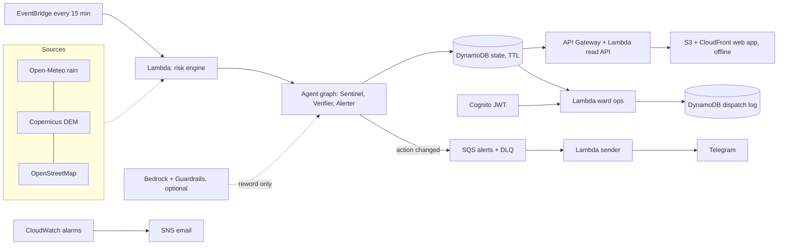

# Architecture

## Safety rules (each has a test)
1. Missing or old data is UNKNOWN and acts as NO-GO (engine, API 404, browser, bot).
2. Worse is accepted at once; better must hold two readings (Verifier).
3. A model may only reword. Its text is dropped unless it keeps the verdict word, adds no new number and claims no safety. Never asked about UNKNOWN.
4. A dispatch list cannot be sent without a named approver, taken from the verified token, and approval is rejected if conditions changed since the person looked.
5. Telegram keeps a chat id and 3 spot ids for 24 h; `/stop` erases; location is not stored.

## Not built
Multi-city, photo reports, route-level check, SACHET/IMD alert feed, real sending of an approved dispatch list (it is recorded, not transmitted).
